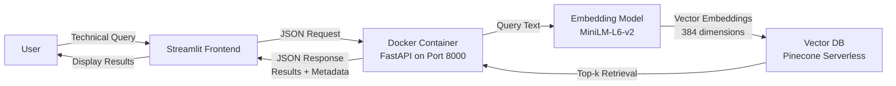

# NeuralQuery

A production-grade, containerized Semantic Search API built with FastAPI, Pinecone (Serverless), and Sentence Transformers.

## Features

- Semantic Search: Vector-based semantic search using transformer models
- Fault-Tolerant API: Error handling and health checks
- Defensive Programming: Validation and error handling
- Production-Ready: Dockerized with security best practices
- Scalable: Serverless Pinecone backend for automatic scaling
- Type-Safe: Type hints and Pydantic validation

## Tech Stack

- Python 3.9
- FastAPI - Modern web framework for building APIs
- Streamlit - Interactive web frontend
- Pinecone (Serverless) - Managed vector database
- Sentence Transformers - Semantic embeddings (all-MiniLM-L6-v2)
- Docker - Containerization
- Pydantic v2 - Data validation
- Uvicorn - ASGI server

## Prerequisites

Before you start, you'll need:

- Python 3.9 or higher
- A Pinecone account and API key (sign up at https://www.pinecone.io/)
- Docker (optional, for containerized deployment)
- pip or pipenv

## Installation

### 1. Clone the Repository

```bash
git clone <your-repo-url>
cd NeuralQuery
```

### 2. Create Virtual Environment

```bash
python3.9 -m venv venv
source venv/bin/activate  # On Windows: venv\Scripts\activate
```

### 3. Install Dependencies

```bash
pip install -r requirements.txt
```

### 4. Environment Configuration

Create a `.env` file in the project root:

```env
PINECONE_API_KEY=your_pinecone_api_key_here
```

To get your Pinecone API Key:
1. Sign up at pinecone.io
2. Create a new project
3. Go to the API Keys section
4. Copy your API key to the `.env` file

## Usage

### Step 1: Populate the Index

Before running the API, populate the Pinecone index with data:

```bash
python -m app.indexer
```

This script will:
- Validate your environment configuration
- Create the "neural-search" index (384 dimensions, Serverless on AWS us-east-1)
- Generate 20 synthetic technical tips (Docker, Python, AWS)
- Encode and upload vectors to Pinecone in batches of 100

Expected output:
```
Validating environment...
Environment validation passed.
Initializing Pinecone client...
Index 'neural-search' does not exist. Creating...
Successfully created index 'neural-search' with dimension 384.
Loading sentence transformer model 'all-MiniLM-L6-v2'...
Encoding documents...
Upserting 20 vectors in batches of 100...
Indexing completed successfully!
```

### Step 2: Run the API

#### Option A: Local Development

```bash
uvicorn app.main:app --host 0.0.0.0 --port 8000 --reload
```

The `--reload` flag enables hot-reloading for development.

#### Option B: Docker (Production)

```bash
# Build the image
docker build -t neuralquery:latest .

# Run the container
docker run -p 8000:8000 --env-file .env neuralquery:latest
```

The API will be available at `http://localhost:8000`

### Step 3: Run the Frontend (Optional)

After the API is running, you can launch the Streamlit frontend for a user-friendly interface:

```bash
streamlit run frontend.py
```

The frontend will be available at `http://localhost:8501` and will automatically connect to the API running on port 8000.

## Quick Start (Frontend)

To quickly get started with the interactive frontend:

1. Make sure the API is running (see Step 2 above)
2. Install dependencies (if you haven't already):
   ```bash
   pip install -r requirements.txt
   ```
3. Launch the Streamlit frontend:
   ```bash
   streamlit run frontend.py
   ```
4. Open your browser to `http://localhost:8501`
5. Enter a search query and click "Search"

The frontend provides:
- Real-time API health status
- Interactive search interface
- Expandable result cards with similarity scores
- Category filtering and metadata display
- Error handling with helpful troubleshooting messages

## API Documentation

### Interactive Documentation

Once the API is running, you can access:
- Swagger UI: http://localhost:8000/docs
- ReDoc: http://localhost:8000/redoc

### Endpoints

#### GET /

Root endpoint with API information.

Response:
```json
{
  "message": "NeuralQuery Semantic Search API",
  "version": "1.0.0",
  "docs": "/docs",
  "health": "/health"
}
```

#### GET /health

Health check endpoint that verifies Pinecone connection.

Response:
```json
{
  "status": "healthy",
  "service": "NeuralQuery API",
  "index": "neural-search",
  "total_vectors": 20
}
```

#### POST /search

Semantic search endpoint.

Request Body:
```json
{
  "query": "How do I optimize Docker images?",
  "top_k": 3
}
```

Parameters:
- `query` (string, required): Search query text (minimum 3 characters)
- `top_k` (integer, optional): Number of results to return (1-10, default: 3)

Response:
```json
{
  "results": [
    {
      "id": "doc_0",
      "score": 0.85,
      "metadata": {
        "category": "Docker"
      }
    }
  ],
  "query": "How do I optimize Docker images?",
  "top_k": 3
}
```

### Example Requests

#### Using cURL

```bash
# Health check
curl http://localhost:8000/health

# Search
curl -X POST "http://localhost:8000/search" \
  -H "Content-Type: application/json" \
  -d '{
    "query": "Python async programming",
    "top_k": 5
  }'
```

#### Using Python

```python
import requests

# Search
response = requests.post(
    "http://localhost:8000/search",
    json={
        "query": "AWS Lambda configuration",
        "top_k": 3
    }
)

results = response.json()
for result in results["results"]:
    print(f"Score: {result['score']:.3f} | {result['metadata']}")
```

#### Using JavaScript/Node.js

```javascript
const response = await fetch('http://localhost:8000/search', {
  method: 'POST',
  headers: { 'Content-Type': 'application/json' },
  body: JSON.stringify({
    query: 'Docker best practices',
    top_k: 3
  })
});

const data = await response.json();
console.log(data.results);
```

## Docker Deployment

### Build

```bash
docker build -t neuralquery:latest .
```

### Run

```bash
docker run -d \
  --name neuralquery \
  -p 8000:8000 \
  --env-file .env \
  neuralquery:latest
```

### Docker Compose (Optional)

Create a `docker-compose.yml`:

```yaml
version: '3.8'

services:
  api:
    build: .
    ports:
      - "8000:8000"
    env_file:
      - .env
    restart: unless-stopped
```

Run with:
```bash
docker-compose up -d
```

## Project Structure

```
NeuralQuery/
├── .env                    # Environment variables (create this)
├── .gitignore              # Git ignore rules
├── requirements.txt        # Python dependencies
├── Dockerfile             # Production Docker configuration
├── README.md              # This file
├── frontend.py            # Streamlit frontend interface
└── app/
    ├── __init__.py        # Package init (optional)
    ├── indexer.py         # Data ingestion script
    └── main.py            # FastAPI application
```

## Architecture

### System Architecture Diagram



### Indexer (app/indexer.py)

The indexer handles data ingestion with several safety checks:
- Environment validation to ensure required variables are set
- Index management that creates or validates the Pinecone index (384 dimensions)
- Batch processing that upserts vectors in batches of 100
- Defensive programming with comprehensive error handling

### API (app/main.py)

The API provides the search interface:
- Startup events that load the model once at startup (not per request)
- Health monitoring via the /health endpoint for status checks
- Error handling that returns appropriate status codes:
  - PineconeException returns 503 Service Unavailable
  - General exceptions return 500 Internal Server Error
- Type safety through Pydantic models for request/response validation

### Frontend (frontend.py)

The Streamlit frontend provides a user-friendly interface:
- Clean, modern chat interface for search queries
- Real-time API health monitoring
- Expandable result cards with similarity scores and metadata
- Graceful error handling with helpful messages

## Error Handling

The API implements error handling for common scenarios:

- 503 Service Unavailable: Pinecone connection issues
- 500 Internal Server Error: Unexpected errors
- 422 Unprocessable Entity: Validation errors (invalid request format)
- 400 Bad Request: Invalid query parameters

## Configuration

### Index Configuration

The index is configured with:
- Index Name: neural-search
- Dimension: 384 (required by all-MiniLM-L6-v2 model)
- Metric: Cosine similarity
- Spec: Serverless (AWS, us-east-1)

### Model Configuration

- Model: all-MiniLM-L6-v2
- Dimension: 384
- First Load: Downloads model (~90MB) on first use

## Troubleshooting

### "PINECONE_API_KEY environment variable is required"

Make sure your `.env` file exists in the project root and contains a valid PINECONE_API_KEY. Check for typos or extra spaces in the key.

### "Failed to connect to index 'neural-search'"

Run the indexer first with `python -m app.indexer`. Verify the index exists in your Pinecone dashboard and that your API key has the proper permissions.

### "Model download slow"

The first run downloads the model (~90MB), which can take a minute or two. Subsequent runs use the cached model, which is stored in `~/.cache/torch/sentence_transformers/`.

### Docker Issues

Make sure your `.env` file exists before building. Use the `--env-file .env` flag when running the container. Check logs with `docker logs neuralquery` if something isn't working.

### Port Already in Use

If port 8000 is already in use, you can find the process with:
```bash
lsof -i :8000
```

Or use a different port:
```bash
uvicorn app.main:app --host 0.0.0.0 --port 8001
```


## Contributing

Contributions, issues, and feature requests are welcome. Feel free to open an issue or submit a pull request.
